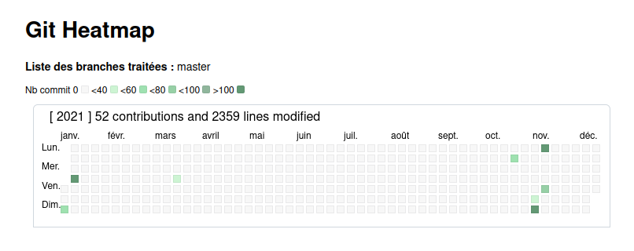

# some links

    curl -L -O https://github.com/d3/d3/releases/download/v5.12.0/d3.zip


# git-heatmap



Generates an github like svg heatmap for the last year of changes of the current
git repository. (see [heatmap.html](heatmap.html))


```bash
    curl -o some/dir/in/path/git-heatmap https://raw.githubusercontent.com/fccagou/tools/master/git/git-heatmap \
    && chmod +x some/dir/in/path/git-heatmap

    git heatmap help

GIT-HEATMAP(1)

NAME

        git-heatmap [--help|help]
                 [--all-in-one[=<filename>]]
                 [--aggregate]
                 [--color-legend]
                 [--id=<string_id>]
                 [--no-inline-html]
                 [--output-dir=DIR_FOR_MULTI_FILES]
                 [--svg-fill]
                 [--title=<string>]
                 [--update-css]
                 [--update-graph]
                 [--update-js]
                 [--years=[ all | YYYY,[AAAA,BBBB] ]
                 [branch1,[branch2,...]
             ]

    --help|help                           : this help

    --all-in-one                          : If many branches are provided, add all svg in one file
                                            and all is send on stdout.
                                            If a value is set, the value will be used for destinaton
                                            file. Default is "/dev/shm/git_heatmap/heatmap.html"
                                            Default is "no"

    --aggregate                           : In case of many branches, make a graphe with the sum
                                            off all branches. Dafault is "no"

    --color-legend                        : display only the color legend (for debug)

    --id                                  : An id used to identifiy the results.
                                            The id must be a string in [A-Za-z-_]* format.
                                            The id is used in html title dans put files name.

    --no-inline-html                      : Css and js will be created in external files;
                                            Default is "yes"

    --output-dir                          : Creates one file by year in DIR_FOR_MULTI_FILES dir.
                                            Default is "/dev/shm/git_heatmap"

    --svg-fill                            : Fill svg instead of using css coloration.
                                            Usefull with --update-graph to insert svg in other web page.
                                            Default is "no"

    --title                               : Set html page title. Default is "Git Heatmap"

    --update-css                          : Update css file (see --inline-html doc)

    --update-graph                        : Only generate svg. Default is "no".
                                            File will be created in "/dev/shm/git_heatmap/heatmap.svg"
                                            unless "--all-in-one" or "--outut-dir" params
                                            are used.

    --update-js                           : Update js  file (see --inline-html doc)


    --years                               : All years in YYYY format separated by ','.
                                            If not set, the current year is used.
                                            If set to "all", all the repo years will checked since
                                            the first commit.

    branch1,[branch2,...]]                : All the branches to check separated by ','.
                                            Default is current branch.
```

EXAMPLE

```bash
    # -- Current year activity for current branch in default dir.
    $ git heatmap
     |-> /dev/shm/git_heatmap/2021.html

    xdg-open /dev/shm/somefile.html

    # -- Create graphs for years 2021 and 2020
    $ git heatmap  --years=2021,2020
     |-> /dev/shm/git_heatmap/2021.html
     |-> /dev/shm/git_heatmap/2020.html

    # -- Years 2021 and 2020 in one file
    $ git heatmap  --years=2021,2020 --all-in-one
     |-> all in /dev/shm/git_heatmap/heatmap.html

    # -- Years 2021 and 2020 in one file
    $ git heatmap  --years=2021,2020 --all-in-one=/tmp/all.html
     |-> all in /tmp/all.html

    # -- Activities sinc the firt commit
    git heatmap --years=all --all-in-one --title="my repo name"
    |-> all in /dev/shm/git_heatmap/all.html
    xdg-open /dev/shm/git_heatmap/all.html

    # Create svg only in local dir
    $ git heatmap  --update-graph  --all-in-one=heatmap.html --years=2021,2020
    [+] Export svg
     |-> all in one file : heatmap.html
     |-> 2021
     |-> 2020

   # Creates all in /dev/shm/git-heatmap-all.html
   $ git heatmap  --all-in-one=/dev/shm/git-heatmap-all.html
   [+] Generate css and js
    |-> inline html
   [+] Generate html pages
    |-> all in /dev/shm/git-heatmap-all.html

   $ xdg-open /dev/shm/git-heatmap-all.html

```

